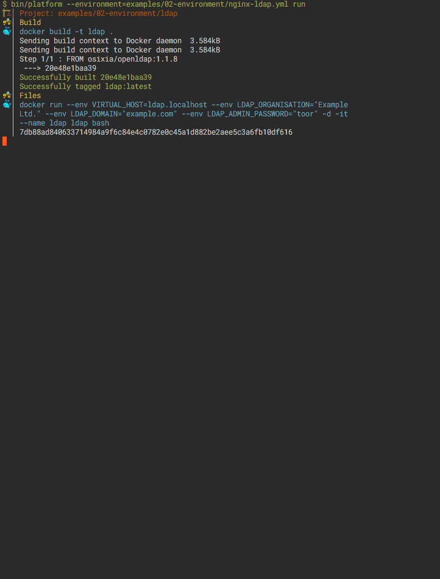

# Platform Project Development

[](https://travis-ci.org/7ojo/perl6-platform) [](https://ci.appveyor.com/project/7ojo/perl6-platform/branch/master)



# SYNOPSIS

  ``` 
  Usage:	platform COMMAND

  A tool for running projects through container environment programmatible way

  Options:
    -D, --debug              Enable debug mode
    -a, --data-path string   Location of resource files (default "/Users/tojo/.platform")
    -d, --domain string      Domain address (default "localhost")
    -n, --network string     Network name (default "acme")

  Commands:
    attach      Attach to a running container through shell
    create      Start shared platform services
    destroy     Shutdown shared platform services
    remove      Initialize single project or environment with collection of projects
    rm          Remove stopped project or environment
    run         Initialize single project or environment with collection of projects
    ssh         Wrapper to ssh* commandds
    ssl         Wrapper to openssl command
    start       Start suspended project or environment
    stop        Stop suspended project or environment

  Run 'platform COMMAND --help' for more information on a command.
  ```

# Documentation

See http://p6-platform.readthedocs.io for documentation

# Installing

Quick and dirty if you have perl6 already installed:

  ```zef install App::Platform```


