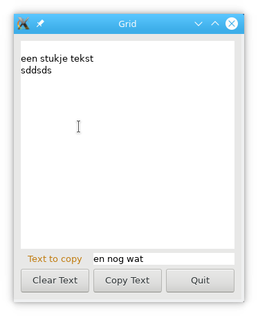

[toc]

# Design and run phase

```plantuml
'title Design and use of code
hide empty description

skinparam state {
  BackgroundColor<<file>> #ff8800
  BorderColor<<file>> #555555
}


state "xyz.ui" as gladeFile <<file>>
state "xyz.pm6" as perlModule <<file>>
state "GTK::Glade.pm6" as perlLibModule <<file>>


'[*] --> Prepare
state "Preparation of\ncode and data" as Prepare {

  Design: Design user interface\nusing glade and\nsave ui description
  Design --> gladeFile: save

  Design -> P6Code: user\naction
  P6Code --> perlModule: save
  P6Code: Perl6 Engine class\nwith methods for all\ndefined signals

  'P6Code -> [*]
}

[*] --> Design: user\naction


state "Perl6 program" as P6CodeFlow {
  state "GTK::Glade" as GTKGlade
  state "GTK::Glade::Engine" as Engine

  '[*] -> Engine
  perlLibModule --> GTKGlade: "use GTK::Glade;"
  gladeFile --> GTKGlade: ":file('xyz.ui')"
  perlModule --> Engine: "use xyz;"
  Engine -> GTKGlade: ":engine($obj)"
  'GTKGlade -> [*]: Exit main\nloop
}

Prepare --> P6CodeFlow: Start\nprogram
'P6CodeFlow --> [*]
GTKGlade --> [*]: Exit main\nloop
```

# Example glade design


To design a state layer to test this design I first show a state diagram of the programs behavior. The relevant widgets have the following id's; `inputTxt` for the small imput text, `outputTxt` for the large one, `quitBttn`, `copyBttn` and `clearBttn` for the buttons.

```plantuml
scale 0.7
hide empty description

state "Start state\nof program" as start

[*] --> start
start --> clear: clearBttn\npressed
clear: get text buffer from outputTxt widget and show
clear: empty buffer
clear --> start

start --> copy: copyBttn\npressed
copy: get text buffer from inputTxt widget
copy: get text from buffer and empty buffer
copy: get text buffer from outputTxt widget
copy: append input text to output text
copy: set buffer to new text
copy --> start

start --> quit: quitBttn\npressed

user --> editLarge: text
editLarge: add text to outputTxt

user --> editSmall: text
editSmall: add text to inputTxt

start --> user: start edit

quit --> [*]
```

A small table of defined signals and their callbacks

 |widget|event|handler
 |------|-----|-------
 |clearBttn       |clicked      |clear-text
 |copyBttn        |clicked      |copy-text
 |quitBttn        |clicked      |exit-program

So to get all tested one can perform the steps
* Clear all text windows.
* Test that those windows have empty strings
* Add text into large window
* Get text and compare with original
* Emit clearBttn:clicked signal and check that text in large window is empty.

# Classes and relations
* All classes which work with GtkWidget e.g. return them on xyz_new(), are inheriting the GtkWidget class.

```plantuml

hide members
hide circle

class GtkWidget

class GtkBin
class GtkContainer

class GtkLabel

class GtkButton
class GtkToggleButton
class GtkCheckButton
class GtkRadioButton

class GtkWindow
class GtkDialog
class GtkAboutDialog

GtkWidget <|-- GtkButton
GtkButton <|-- GtkToggleButton
GtkToggleButton <|-- GtkCheckButton
GtkCheckButton <|-- GtkRadioButton

GtkWidget <|-- GtkWindow
GtkWindow <|-- GtkDialog
GtkDialog <|-- GtkAboutDialog

GtkWidget <|-- GtkLabel

GtkContainer <|-- GtkBin
GtkWidget "*" -* GtkContainer
'GtkBin --* GtkButton

```
