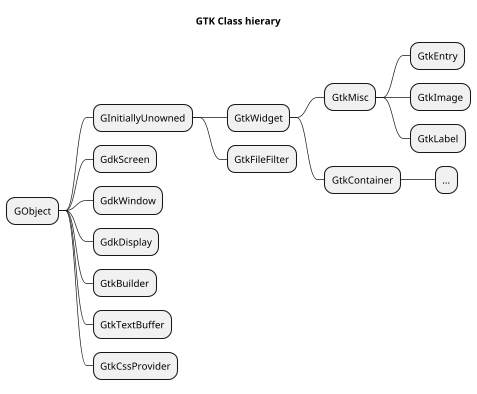
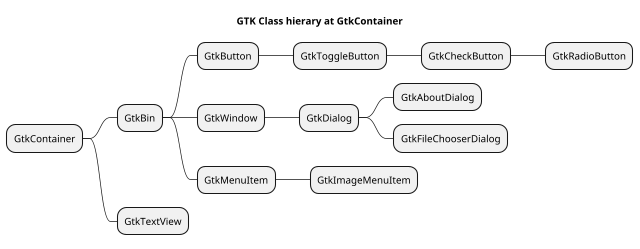
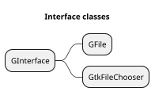
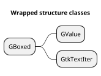
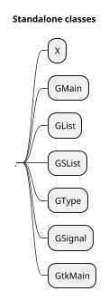

[toc]

# Class hierargy
* Below are diagrams of what is implemented. See also the [object hierarchy in GTK docs](https://developer.gnome.org/gtk3/stable/ch02.html).














<!-- Restjes ...

```plantuml
scale 0.7
hide members
hide circle

'class Gui
'class GSignal
'GSignal <|-- GtkWidget
'X <-* Gui


GtkBin <|-- GtkButton
GtkButton <|-- GtkToggleButton
GtkToggleButton <|-- GtkCheckButton
GtkCheckButton <|-- GtkRadioButton

GtkBin <|-- GtkWindow
GtkWindow <|-- GtkDialog
GtkDialog <|-- GtkAboutDialog
GtkDialog <|-- GtkFileChooserDialog

GtkWidget <|-- GtkLabel
GtkWidget <|-- GtkEntry

GtkContainer <|-- GtkBin
GtkContainer <|-- GtkTextView
GtkWidget <|-- GtkContainer

GInitiallyUnowned <|-- GtkWidget
GObject <|-- GInitiallyUnowned

GtkBin <|-- GtkMenuItem
GtkMenuItem <|-- GtkImageMenuItem

GInitiallyUnowned <|-- GtkFileFilter

```
-->
