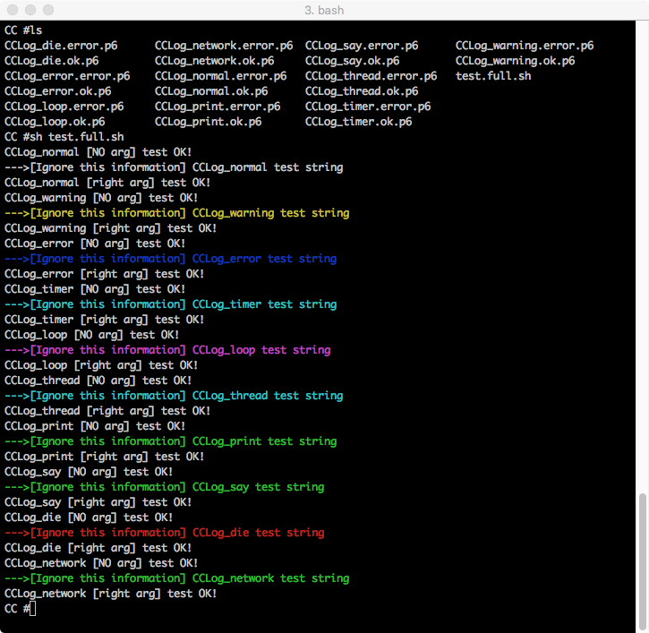
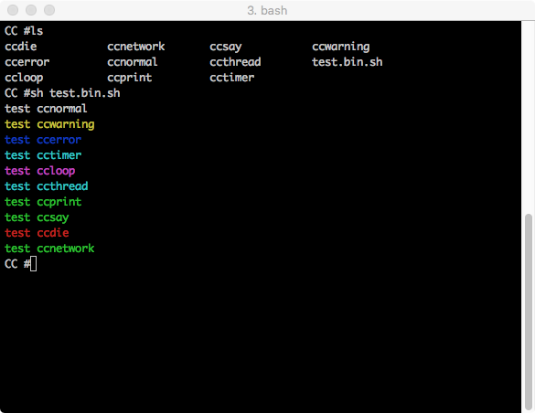
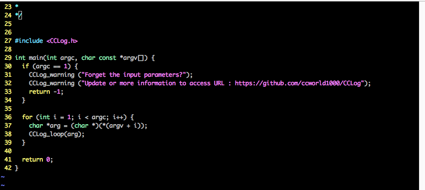
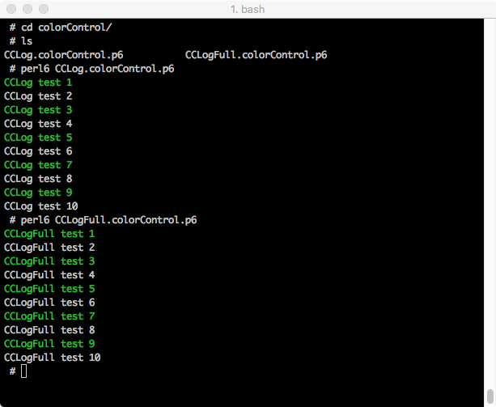
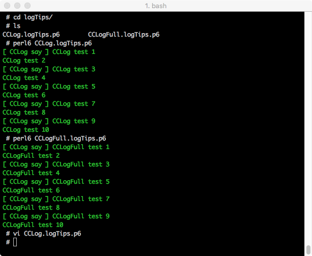

## CCLog
    Simple and lightweight cross-platform logs,
    easy-to-use simple learning,
    and support for multiple languages,
    such as C, C++, Perl 6, shell, Objective-C

## Perl 6
    There are 2 (CCLog & CCLogFull) ways of binding.

Call CCLog.pm6

Call CCLogFull.pm6

## Shell
    Provide simple commands. fg: 
		ccnormal
		ccwarning
		ccerror
		cctimer
		ccloop
		ccthread
		ccprint
		ccsay
		ccdie
		ccnetwork

    These commands are automatically installed locally and can be called directly.

Call shell

## C && C++ && Objective-C
    You can use C library or C source (CCLog.h CCLog.c) code directly.

Call C && C++ && Objective-C

## Objective-C
    Objective-C can call C directly, Or follow other ways to import.

## Local installation and unloading
    zef install .
    zef uninstall CCLog

## Network install
    zef update
    zef install CCLog

## Check if the installation is successful

The installation may be as follows

Installation failure may be as follows, you can try again

## Color display control
  Perl6 CCLog.pm6 call ccshowColor
  Perl6 CCLogFull.pm6 call CCLog_showColor
  C && C++ && Objective-C call CCLog_showColor
  fg:
  

## Tips display control
  fg:
  

