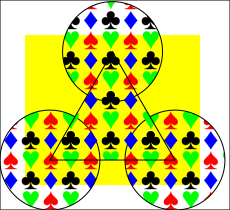

PDF::API6 - A Perl 6 PDF Tool-chain
===

- [NAME](#name)
- [DESCRIPTION](#description)
- [EXAMPLE](#example)
- [DIFFERENCES BETWEEN PDF::API2 AND PDF::API6](#differences-between-pdfapi2-and-pdfapi6)
   - [PDF::API6](#pdfapi6)
   - [TODO](#todo)
- [SYNOPSIS](#synopsis)
- [SECTION I: Low Level Methods (inherited from PDF)](#section-i-low-level-methods-inherited-from-pdf)
   - [Input/Output](#inputoutput)
       - [new](#new)
       - [open](#open)
       - [update](#update)
       - [save-as](#save-as)
       - [encrypt](#encrypt)
       - [is-encrypted](#is-encrypted)
   - [Serialization Methods](#serialization-methods)
       - [Str, Blob](#str-blob)
       - [ast](#ast)
- [SECTION II: Content Methods (inherited from PDF::Lite)](#section-ii-content-methods-inherited-from-pdflite)
   - [Pages](#pages)
       - [page-count](#page-count)
       - [page](#page)
       - [add-page](#add-page)
       - [delete-page](#delete-page)
   - [Page Methods](#page-methods)
       - [to-xobject](#to-xobject)
       - [images](#images)
       - [Rotate](#rotate)
   - [Introduction to Graphics](#introduction-to-graphics)
   - [Text Methods](#text-methods)
       - [text](#text)
       - [font, core-font](#font-core-font)
       - [text-position](#text-position)
       - [text-transform](#text-transform)
       - [print](#print)
       - [say](#say)
   - [Graphics Methods](#graphics-methods)
       - [graphics](#graphics)
       - [transform](#transform)
       - [paint](#paint)
   - [Image Methods](#image-methods)
       - [load-image](#load-image)
       - [do](#do)
   - [XObject Forms](#xobject-forms)
       - [xobject-form](#xobject-form)
   - [Patterns](#patterns)
       - [tiling-pattern](#tiling-pattern)
       - [use-pattern](#use-pattern)
   - [Low Level Graphics](#low-level-graphics)
       - [Colors](#colors)
       - [Painting](#painting)
   - [Rendering Methods](#rendering-methods)
       - [render](#render)
- [SECTION III: PDF::API6 Specific Methods](#section-iii-pdfapi6-specific-methods)
   - [Metadata Methods](#metadata-methods)
       - [info](#info)
       - [xmp-metadata](#xmp-metadata)
   - [Settings Methods](#settings-methods)
       - [preferences](#preferences)
       - [version](#version)
       - [page-labels](#page-labels)
- [APPENDIX](#appendix)
   - [Appendix I: Graphics](#appendix-i-graphics)
       - [Graphics Variables](#graphics-variables)
       - [Graphic Operators](#graphic-operators)
       - [Graphics State](#graphics-state)
       - [Text Operators](#text-operators)
       - [Path Construction](#path-construction)
       - [Path Painting Operators](#path-painting-operators)
       - [Path Clipping](#path-clipping)
       - [Marked Content](#marked-content)

# NAME

PDF::API6 - Facilitates the creation and modification of PDF files

# DESCRIPTION

A Perl 6 PDF module; reminiscent of Perl 5's PDF::API2.

This module is a work in progress in replicating, or mapping the functionality of Perl 5's PDF::API2 tool-chain.

# EXAMPLE

```
use v6;
use PDF::API6;

my PDF::API6 $pdf .= new;
my $page = $pdf.add-page;
$page.MediaBox = [0, 0, 200, 100];

$page.graphics: {
    my $text-block = .text: {
        .font = .core-font( :family<Helvetica>, :weight<bold>, :style<italic> );
        .text-position = [10, 10];
        .say: 'Hello, world';
    }

    my $img = .load-image: "t/images/lightbulb.gif";
    .do($img, 20 + $text-block.width, 10);
}

$pdf.save-as: "tmp/hello-world.pdf";
```


# DIFFERENCES BETWEEN PDF::API2 AND PDF::API6

## PDF::API6

- Has a Graphics State engine. This is based on the graphics operators and variables as described PDF 32000 chapter 8 "Graphics and the operators".

- Supports the creation and manipulation of XObject Forms and Patterns.

- Implements an Object Graph model for data access. A PDF file is modelled as an object tree of Dictionaries (Hashes) and Arrays that contain simpler
values such as Integers, Reals and Strings.

- Has fast incremental updates. Small changes to a large PDF can often be quite efficiently.

## TODO

Some PDF::API2 features that are not yet available in PDF::API6

- Fonts. PDF::API6 currently only handles the standard 14 core fonts. No yet supported:

    - `psfont' - for loading postscript fonts
    - `ttfont` - for loading true type fonts
    - `synfont` - for creating synthetic fonts
    - `bdfont` - for creating BDF fonts
    - `unifont` - for Unicode fonts

- Images. PDF::API6 supports PNG, JPEG and GIF images

    - currently not supported are: TIFF, PNM and GIF images.

- Color-Spaces. PDF::API6 supports Gray, RGB and CMYK colors. Not supported yet:

    - Separation color-spaces
    - DeviceN color-spaces

- Annotations

- Outlines

- Destinations

# SYNOPSIS

    use PDF::API6;

    # Create a blank PDF file
    my PDF::API6 $pdf .= new();

    # Open an existing PDF file
    $pdf = PDF::API6.open('some.pdf');

    # Add a blank page
    my $page = $pdf.add-page();

    # Retrieve an existing page
    $page = $pdf.page($page-number);

    # Set the page size
    use PDF::Content::Page :PageSizes;
    $page.media-box = Letter;

    # Add a built-in font to the PDF
    $font = $pdf.core-font('Helvetica-Bold');

    # Add an external TTF font to the PDF
    #NYI $font = $pdf.ttfont('/path/to/font.ttf');

    # Add some text to the page
    $page.text: {
        .font = $font, 20;
        .text-position = 200, 700;
        .say('Hello World!');
    }

    # Save the PDF
    $pdf.save-as('/path/to/new.pdf');

# SECTION I: Low Level Methods (inherited from PDF)

## Input/Output

### new

Creates a new PDF object.

    my PDF::API6 $pdf .= new();
    #...
    print $pdf.Str;
    $fh.write: $pdf.Blob;

    $pdf = PDF::API6.new();
    #...
    $pdf.save-as('our/new.pdf');


### open

Opens an existing PDF or JSON file.

    my PDF::API6 $pdf .= open('our/old.pdf');
    #...
    $pdf.save-as('our/new.pdf');

    # open from a stream
    my PDF::API6 $pdf2 .= open($pdf.Blob);


Open an encrypted document:

    PDF::API6.open( "enc.pdf", :password<shh1> );


Open a PDF, ignoring the cross reference index and stream lengths:

    PDF::API6.open( "damaged.pdf", :repair );

### update

Performs a fast incremental save of a previously opened document.

    PDF::API6 $pdf .= open('our/to/be/updated.pdf');
    #...
    $pdf.update();

### save-as

Save the document to a file

    PDF::API6 $pdf .= new;
    #...
    $pdf.save-as: 'our/new.pdf';

The `:preserve` option keeps the original PDF structure. This is generally faster and also ensures that digital signatures are not invalidated.

    PDF::API6 $pdf .= open("our/original.pdf");
    #...
    $pdf.save-as: 'our/updated.pdf', :preserve;

A PDF file can also be saved as, and opened from an intermediate JSON representation

    PDF::API6 $pdf .= new;
    #...
    $pdf.save-as: 'our/ast.json';
    # ...
    $pdf.open: 'our/ast.json';

### encrypt

Encrypt a PDF:

    $pdf.encrypt( :owner-pass<ssh1>, :user-pass<abc>, :aes );

### is-encrypted

Check if document is encrypted

    if $pdf.is-encrypted

## Serialization Methods

### Str, Blob

Return a binary representation of a PDF as a latin-01 string, or binary Blob

    Str $latin-1 = $pdf.Str;  Blob $bytes = $pdf.Blob;

### ast

Return an AST tree representation of a PDF.

    my %ast = $pdf.ast


# SECTION II: Content Methods (inherited from PDF::Lite)

## Pages

### page-count

    my UInt $pages = $pdf.page-count;

Returns the number of pages in a PDF.

### page

    my $second-page = $pdf.page(2);

Returns the nth page from the PDF

### add-page

Synopsis: `$pdf.add-page($page-object?)`

    my $add-page = $pdf.add-page;

Adds a page to the end of a PDF. Creates a new blank page by default.

### delete-page

Deletes a page, by page-number

    my $moved-page = $pdf.delete-page(2);
    # re-add the to the end of the PDF
    $pdf.add-page($moved-page);


## Page Methods

### to-xobject

Converts a page to an [XObject Form](#xobject-forms).

This is useful if you want to transpose the imported page somewhat differently onto a page (e.g. two-up, four-up, etc.).

Example:

    use PDF::API6;
    my PDF::API6 $old .= open('our/old.pdf');
    my PDF::API6 $pdf .= new;
    my $page = $pdf.add-page;
    my $gfx = $page.gfx;

    # Import Page 2 from the old PDF
    my $xo = $pdf.page(2).to-xobject;

    # Add it to the new PDF's first page at 1/2 scale
    my $width = $xo.width / 2;
    $gfx.do($xo, 0, 0, :$width);

    $pdf.save-as('our/new.pdf');

### images

Synopsis: `my PDF::Content::XObject[Image] @images = $gfx.images: :inline;`

This method returns image objects for a given page, or other graphical element:

The `:inline` flag will check for any image objects in the graphical content stream.

### Rotate

    $page.Rotate = 90;

Read/write accessor to rotate the page. Angles must be multiples of 90 degrees.

## Introduction to Graphics

Graphics form the basis of PDF rendering and display. This includes text, images,
graphics, colors and painting.

Each page has associated graphics these can be access by the`.gfx` method.

```
use v6;
use PDF::API6;

my PDF::API6 $pdf .= open("tmp/hello-world.pdf");
# dump existing graphics on page 1
my $page = $pdf.page(1);
my $gfx = $page.gfx;
dd $gfx.content-dump; # dump existing graphics operations

# add some more text to the page
$gfx.font = $gfx.core-font: :family<Courier>;
$gfx.text: {
    .text-position = (10, 30);
    .say("Demo added text");
}

```

See also [Patterns](#patterns) and [XObject Forms](#xobject-forms) which also have associated graphics.

## Text Methods

### text

Synopsis: `$gfx.text: &block`

This is a convenience method, that executes code in a text block. Text blocks
cannot be nested. Nor can they contain a graphics block.

    $page.text: {
        .text-position = 30, 50;
        .say "hi";
    }

is equivalent to:

    given $page.gfx {
        .BeginText;
        .text-position = 30, 50;
        .say "hi";
        .EndText;
    }

### font, core-font

    $gfx.font = $gfx.core-font( :family<Helvetica>, :weight<bold>, :style<italic> );
    $gfx.font = $gfx.core-font('Times-Bold');
    $gfx.font = $gfx.core-font('ZapfDingbats');

Todo: Other font types (`tt-font`, `ps-font`, `uni-font`, ...)

Read/write accessor to set, or get the current font

### text-position

    $gfx.text-position = 10,20;
    $gfx.say('text @10,20');

Gets or sets the current text output position.

### text-transform

Synopsis: `$gfx.text-transform: :$matrix, :translate[$x,$y], :rotate($rad), :scale[$s, $sy?], :skew[$x,y];`

Applies text transforms, such as translation, rotation, scaling, etc.

    $gfx.text-transform: :translate[110, 10], :rotate(.1);

- Text transforms are applied after any [Graphics Transform](#transform).

- This replaces any existng text positioning or transforms.

### print

    need PDF::Content::Text::Block;
    my PDF::Content::Text::Block $text-block;
    
    $gfx.WordSpacing = 2; # add extra spacing between words
    my $font = PDF::Content::Util::Font::core-font( :family<Helvetica>, :weight<bold> );
    my $font-size = 16;
    my $text = "Hello.  Ting, ting-ting. Attention! … ATTENTION! ";
    
    $text-block = $gfx.print: $text, :$font, :$font-size, :width(120);
    
    note "text block has size {.width} X {.height}"
        with $text-block;

Synopsis: `my $text-block = print($text-str-or-chunks-or-block,
                 :align<left|center|right>, :valign<top|center|bottom>,
                 :$font, :$font-size,
                 :$.WordSpacing, :$.CharSpacing, :$.HorizScaling, :$.TextRise
                 :baseline-shift<top|middle|bottom|alphabetic|ideographic|hanging>
                 :kern, :$leading, :$width, :$height)`

Outputs a text string, or [Text Block](https://github.com/p6-pdf/PDF-Content-p6/blob/master/lib/PDF/Content/Text/Block.pm)

### say

Takes the same parameters as `print`. Sets the final text position (`$.text-position`) to the next line.

## Graphics Methods

### graphics

Synopsis: `$gfx.graphics: &block`

This is a convenience method, that executes code in a nested Save/Restore block.

    $page.graphics: {
        .Rectangle(10,20,100,50);
        .Fill;
    }

is equivalent to:

    given $page.gfx {
        .Save;
        .Rectangle(10,20,100,50);
        .Fill;
        .Restore;
    }

### transform

Synopsis: `$gfx.transform: :$matrix, :translate[$x,$y], :rotate($rad), :scale[$s, $sy?], :skew[$x,y];`

Applies a graphics transform, such as translation, rotation, scaling, etc.

    $gfx.transform: :rotate(pi/4), :scale(2);

Unlike [Text Transforms](#text-transform), Graphics Transforms accumulate; and are applied in addition to any existing transforms.

### paint

Synopsis: `$gfx.paint( :close, :stroke, :fill, :even-odd)`

`paint` is a general purpose method for closing, stroking and filling shapes.

    # fill and stroke a rectangle
    $gfx.FillColor = :DeviceRGB[.7, .7, .9];
    $gfx.StrokeColor = :DeviceRGB[.9, .5, .5];
    $gfx.LineWidth = 2.5; # set stroking line-width
    $gfx.Rectangle(0, 20, 100, 250);
    $gfx.paint: :fill, :stroke;


## Image Methods

### load-image

Loads an image in a supported format (currently PNG, GIF and JPEG).

     my $img = $gfx.load-image("t/images/lightbulb.gif");
     note "image has size {$img.width} X {$image.height}";

### do

     $gfx.do($img, 10, 20)

Synopsis: `$gfx.do($image-or-form, $x = 0, $y = 0,
                   :$width, :$height, :inline,
                   :align<left center right> = 'left',
                   :valign<top center bottom> = 'bottom')`

Displays an image or form.

## XObject Forms

A Form is a graphical sub-element. Its usage is the same as an image.

### xobject-form

This graphical method is used to create a new, empty form object:
```
use v6;
use PDF::API6;

my PDF::API6 $pdf .= new;
my $page = $pdf.add-page;
$page.MediaBox = [0, 0, 275, 100];
# create a new XObject form of size 120 x 50
my @BBox = [0, 0, 120, 50];
my $form = $page.xobject-form: :@BBox;

$form.graphics: {
    # color the entire form
    .FillColor = :DeviceRGB[.9, .8, .8];
    .Rectangle: |@BBox;
    .paint: :fill, :stroke;
}

$form.text: {
    # add some sample text
    .font = .core-font('Helvetica');
    .text-position = 10, 10;
    .say: "Sample form";
}

# display the form a couple of times
$page.graphics: {
    .transform: :translate(10, 10);
    .do($form);
    .transform: :translate(130, 0), :rotate(.1);
    .do($form);
}

$pdf.save-as: "tmp/sample-form.pdf";
```


## Patterns

A Pattern is another graphical sub-element. Its construction is similar to a form; its usage is the same as a color.

Patterns are typically used to achieve advanced tiling or shading effects.

Please see [examples/pattern.p6](examples/pattern.p6), which produced:




### tiling-pattern

Synopsis: `my $pattern = $gfx.tiling-pattern( :@BBox, :@Matrix, :$XStep, :$YStep, :$group = True)`

Creates a new tiling pattern.

### use-pattern

Synopsis: `$gfx.FillColor = $gfx.use-pattern($pattern)`

Use a pattern; registering it as graphics resource.


## Low Level Graphics

PDF::API6 fully supports the PDF graphics instruction set, both for reading and
writing PDF files. Direct calls to instructions are camel-cased, such as:

    $gfx.TextMove(10,20);

It is also possible to directly call the TextMove operator 'Td' directly:

    use PDF::Content::Ops :OpCode
    $gfx.op(OpCode::TextMove, 10,20);
    $gfx.op('Td', 10,20);  # TextMove

A number of graphics variables are tracked as the instructions are executed. For example,
to set the line-width for stroking operations:

    $gfx.LineWidth = 2.5;

This is equivalent to:

    $gfx.SetLineWidth(2.5)
         unless $gfx.LineWidth == 2.5;

The `Save` and `Restore` operators may be used to save and restore graphics variables.

    $gfx.LineWidth = 1.5;
    $gfx.Save;
    $gfx.LineWidth = 2.5;
    #...
    $gfx.Restore;
    say $gfx.LineWidth; # 1.5

The `graphics` method simply adds `Save` and `Restore` operators

    $gfx.LineWidth = 1.5;
    $gfx.graphics: {
        .LineWidth = 2.5;
        #...
    }
    say $gfx.LineWidth; # 1.5

### Colors

The PDF Model maintains two separate colors; for filling and stroking:

#### FillColor, FillAlpha

To set an RGB color for filling, or for displaying text:

    $gfx.FillColorSpace = 'DeviceRGB';
    $gfx.FillColorN = [1.0, .5, .5];

Or more commonly:

    $gfx.FillColor = :DeviceRGB[1.0, .5, .5];

There are also Gray and CMYK color-spaces

    $gfx.FillColor = :DeviceGray[.7];
    $gfx.FillColor = :DeviceCMYK[.3, .2, .2, .15];

Also settable is the `FillAlpha`. This is a value between 0.0 (fully transparent) and
1.0 (fully opaque).

Note that `FillAlpha` can also be used to draw semi-transparent images:

    $gfx.FillAlpha = .3;  # make the fill color semi-transparent
    $gfx.Rectangle(10,10,50,75);
    $gfx.Fill; # fill, semi-transparently
    $gfx.do($image, 20,20);  # overlay image, semi-transparently

#### StrokeColor, StrokeAlpha

These are identical to `FillColor`, and `FillAlpha`, except that they are applied to stroking colors:

    # draw a semi-transparent rectangle with red border
    $gfx.StrokeAlpha = .5;  # make the stroke color semi-transparent
    $gfx.StrokeColor = :DeviceRGB[.9, .1, .1];
    $gfx.Rectangle(10,10,50,75);
    $gfx.Stroke;


### Painting

PDF has some [Path Construction](#path-construction) operators, including `MoveTo`,
`LineTo`, `CurveTo` and `ClosePath`. These are normally
followed by either a [Painting](#path-painting-operators) or [Clipping](#path-clipping)
operation. For example:

    $gfx.FillColor = :DeviceRGB[.9, .5, .5];
    $gfx.StrokeColor = :DeviceRGB[.5, .5, .9];
    $gfx.MoveTo(50, 50);
    $gfx.LineTo(175,50);
    $gfx.LineTo(112.5,158.25);
    $gfx.CloseFillStroke; # or $gfx.paint: :close, :fill, :stroke;

## Rendering Methods

### render

This method is used to process graphics; normally after installing
callbacks. These callbacks have access to the graphics state via
the `$*gfx` dynamic variable.

```
use PDF::API6;
use PDF::Content::Ops :OpCode;
my PDF::API6 $pdf .= open: "tmp/basic.pdf";
my $page = $pdf.page: 1;

my sub callback($op, *@args) {
   given $op {
       when TextMove|TextMoveSet|SetTextMatrix {
           note "Text matrix updated by $op to {$*gfx.TextMatrix}";
       }
   }
}

my $gfx = $page.new-gfx: :&callback;
$page.render($gfx);
```

# SECTION III: PDF::API6 Specific Methods

## Metadata Methods

### info

    $info := $pdf.info;

Gets/sets the info for the document

    $pdf.info.Title = 'Some Publication';

Standard `Info` fields include: `Title`, `Author`, `Subject`, `Keywords`, `Creator`, `Producer`, `CreationDate` and `ModDate`.

### xmp-metadata

    Str $xml = $pdf.xmp-metadata;

Gets/sets the XMP XML data stream.

Example:

    my $xml = q:to<EOT>;
        <?xpacket begin='' id='W5M0MpCehiHzreSzNTczkc9d'?>
        <?adobe-xap-filters esc="CRLF"?>
        <x:xmpmeta
          xmlns:x='adobe:ns:meta/'
          x:xmptk='XMP toolkit 2.9.1-14, framework 1.6'>
            <rdf:RDF
              xmlns:rdf='http://www.w3.org/1999/02/22-rdf-syntax-ns#'
              xmlns:iX='http://ns.adobe.com/iX/1.0/'>
                <rdf:Description
                  rdf:about='uuid:b8659d3a-369e-11d9-b951-000393c97fd8'
                  xmlns:pdf='http://ns.adobe.com/pdf/1.3/'
                  pdf:Producer='Perl 6 PDF::API6 version 0.0.1'></rdf:Description>
                </rdf:Description>
            </rdf:RDF>
        </x:xmpmeta>
        <?xpacket end='w'?>
        EOT

    $pdf.xmp-metadata = $xml


## Settings Methods

### preferences

    $pdf.preferences: :hide-toolbar, :first-page{ :page(2), :fit };

Controls viewing preferences for the PDF. Options are:

#### `:page-mode<fullscreen>`

Full-screen mode, with no menu bar, window controls, or any other window visible.

#### `:page-mode<thumbs>`

Thumbnail images visible.

#### `:page-mode<outlines>`

Document outline visible.


#### `:page-layout<singlepage>`

Display one page at a time.

#### `:page-layout<one-column>`

Display the pages in one column.

#### `:page-layout<two-column-left>`

Display the pages in two columns, with odd numbered pages on the left.

#### `:page-layout<two-column-right>`

Display the pages in two columns, with odd numbered pages on the right.

#### `:direction<r2l>`, `:direction<l2r>`

The predominant reading order for text:

- `l2r` Left to right

- `r2l` Right to left (vertical writing systems, such as Chinese, Japanese, and Korean)


#### `:page-scaling<none>`

Disables application page-scaling.


#### `:hide-toolbar`

Specifying whether to hide tool bars.

#### `:hide-menubar`

Specifying whether to hide menu bars.

#### `:hide-windowui`

Specifying whether to hide user interface elements.

#### `:fit-window`

Specifying whether to resize the document's window to the size of the displayed page.

#### `:center-window`

Specifying whether to position the document's window in the center of the screen.

#### `:display-title`

Specifying whether the window's title bar should display the
document title taken from the Title entry of the document information
dictionary.

#### `:after-fullscreen<thumbs>`

Thumbnail images visible after Full-screen mode.

#### `:after-fullscreen<outlines>`

Document outline visible after Full-screen mode.

#### `:print-scaling<none>`

Set the default print setting for page scaling to none.

#### `:duplex<simplex>`

Print single-sided by default.

#### `:duplex<flip-short-edge>`

Print duplex by default and flip on the short edge of the sheet.

#### `:duplex<flip-long-edge>`

Print duplex by default and flip on the long edge of the sheet.

#### `:firstpage{ :$page, *%options }`

Specifying the page (either a page number or a page object) to be
displayed, plus one of the following options:

#### `:firstpage` Options:

##### `:fit`

Display the page designated by page, with its contents magnified just
enough to fit the entire page within the window both horizontally and
vertically. If the required horizontal and vertical magnification
factors are different, use the smaller of the two, centering the page
within the window in the other dimension.

##### `:fith($top)`

Display the page designated by page, with the vertical coordinate top
positioned at the top edge of the window and the contents of the page
magnified just enough to fit the entire width of the page within the
window.

##### `:fitv($left)`

Display the page designated by page, with the horizontal coordinate
left positioned at the left edge of the window and the contents of the
page magnified just enough to fit the entire height of the page within
the window.

##### `:fitr[ $left, $bottom, $right, $top ]`

Display the page designated by page, with its contents magnified just
enough to fit the rectangle specified by the coordinates left, bottom,
right, and top entirely within the window both horizontally and
vertically. If the required horizontal and vertical magnification
factors are different, use the smaller of the two, centering the
rectangle within the window in the other dimension.

##### `:fitb`

Display the page designated by page, with its contents magnified just
enough to fit its bounding box entirely within the window both
horizontally and vertically. If the required horizontal and vertical
magnification factors are different, use the smaller of the two,
centering the bounding box within the window in the other dimension.

##### `:fitbh($top)`

Display the page designated by page, with the vertical coordinate top
positioned at the top edge of the window and the contents of the page
magnified just enough to fit the entire width of its bounding box
within the window.

##### `:fitbv($left)`

Display the page designated by page, with the horizontal coordinate
left positioned at the left edge of the window and the contents of the
page magnified just enough to fit the entire height of its bounding
box within the window.

##### `:xyz[ $left, $top, $zoom ]`

Display the page designated by page, with the coordinates (left, top)
positioned at the top-left corner of the window and the contents of
the page magnified by the factor zoom. A zero (0) value for any of the
parameters left, top, or zoom specifies that the current value of that
parameter is to be retained unchanged.

see also [examples/preferences.p6](examples/preferences.p6)

### version

    $pdf.version = v1.5;

Get or set the PDF Version

### page-labels

Get or sets page numbers to identify each page number, for display or printing:

page-labels is an array of ascending ascending integer indexes. Each is followed
by a page entry hash. For example

    constant PageLabel = PDF::API6::PageLabel;
    $pdf.page-labels = 0  => { :style(PageLabel::Roman) },
                       4  => { :style(PageLabel::Decimal) },
                      32  => { :start(1), :prefix<A-> },
                      36  => { :start(1), :prefix<B-> },
                      40  => { :Style(PageLabel::Roman), :start(1), :prefix<B-> };

# APPENDIX

## Appendix I: Graphics

### Graphics Variables

#### Text Variables

Accessor | Code | Description | Default | Example Setters
-------- | ------ | ----------- | ------- | -------
TextMatrix | Tm | Text transformation matrix | [1,0,0,1,0,0] | `use PDF::Content::Matrix :scale; .TextMatrix = :scale(1.5);`
CharSpacing | Tc | Character spacing adjustment | 0.0 | `.CharSpacing = 1.0`
WordSpacing | Tw | Word spacing adjustment | 0.0 | `.WordSpacing = 2.5`
HorizScaling | Th | Horizontal scaling (percent) | 100 | `.HorizScaling = 150`
TextLeading | Tl | Line height | 0.0 | `.TextLeading = 12;`
Font | [Tf, Tfs] | Text font and size | | `.font = [ .core-font( :family<Helvetica> ), 12 ]`
TextRender | Tmode | Text rendering mode | 0 | `.TextRender = TextMode::OutlineText`
TextRise | Trise | Text rise | 0.0 | `.TextRise = 3`

#### General Graphics - Common

Accessor | Code | Description | Default | Example Setters
-------- | ------ | ----------- | ------- | -------
CTM |  | The current transformation matrix | [1,0,0,1,0,0] | `use PDF::Content::Matrix :scale; .ConcatMatrix: :scale(1.5);`
DashPattern | D |  A description of the dash pattern to be used when paths are stroked | solid | `.DashPattern = [[3, 5], 6];`
FillAlpha | ca | The constant shape or constant opacity value to be used for other painting operations | 1.0 | `.FillAlpha = 0.25`
FillColor| | current fill color-space and color | :DeviceGray[0.0] | `.FillColor = :DeviceCMYK[.7,.2,.2,.1]`
LineCap  |  LC | A code specifying the shape of the endpoints for any open path that is stroked | 0 (butt) | `.LineCap = LineCaps::RoundCaps;`
LineJoin | LJ | A code specifying the shape of joints between connected segments of a stroked path | 0 (miter) | `.LineJoin = LineJoin::RoundJoin`
LineWidth | w | Stroke line-width | 1.0 | `.LineWidth = 2.5`
StrokeAlpha | CA | The constant shape or constant opacity value to be used when paths are stroked | 1.0 | `.StrokeAlpha = 0.5;`
StrokeColor| | current stroke color-space and color | :DeviceGray[0.0] | `.StrokeColor = :DeviceRGB[.7,.2,.2]`

#### General Graphics - Advanced

Accessor | Code | Description | Default
-------- | ------ | ----------- | -------
AlphaSource | AIS | A flag specifying whether the current soft mask and alpha constant parameters are interpreted as shape values or opacity values. This flag also governs the interpretation of the SMask entry | false |
BlackGenerationFunction | BG2 | A function that calculates the level of the black colour component to use when converting RGB colours to CMYK
BlendMode | BM | The current blend mode to be used in the transparent imaging model |
Flatness | FT | The precision with which curves are rendered on the output device. The value of this parameter gives the maximum error tolerance, measured in output device pixels; smaller numbers give smoother curves at the expense of more computation | 1.0 
Halftone dictionary | HT |  A halftone screen for gray and colour rendering
MiterLimit | ML | number The maximum length of mitered line joins for stroked paths |
OverPrintMode | OPM | A flag specifying whether painting in one set of colorants should cause the corresponding areas of other colorants to be erased or left unchanged | false
OverPrintPaint | OP | A code specifying whether a colour component value of 0 in a DeviceCMYK colour space should erase that component (0) or leave it unchanged (1) when overprinting | 0
OverPrintStroke | OP | " | 0
RenderingIntent | RI | The rendering intent to be used when converting CIE-based colours to device colours | RelativeColorimetric
SmoothnessTolerance | ST | The precision with which colour gradients are to be rendered on the output device. The value of this parameter (0 to 1.0) gives the maximum error tolerance, expressed as a fraction of the range of each colour component; smaller numbers give smoother colour transitions at the expense of more computation and memory use.
SoftMask | SMask | A soft-mask dictionary specifying the mask shape or mask opacity values to be used in the transparent imaging model, or the name: None | None
StrokeAdjust | SA | A flag specifying whether to compensate for possible rasterization effects when stroking a path with a line | false
TransferFunction | TR2 |  A function that adjusts device gray or colour component levels to compensate for nonlinear response in a particular output device
UndercolorRemovalFunction | UCR2 | A function that calculates the reduction in the levels of the cyan, magenta, and yellow colour components to compensate for the amount of black added by black generation

### Graphic Operators

#### Color Operators

Method | Code | Description
--- | --- | ---
SetStrokeColorSpace(name) | CS | Set the current space to use for stroking operations. This can be a standard name, such as 'DeviceGray', 'DeviceRGB', 'DeviceCMYK', or a name declared in the parent's Resource<ColorSpace> dictionary.
SetStrokeColorSpace(name) | cs | Same but for non-stroking operations.
SetStrokeColor(c1, ..., cn) | SC | Set the colours to use for stroking operations in a device. The number of operands required and their interpretation depends on the current stroking colour space: DeviceGray, CalGray, and Indexed colour spaces, have one operand. DeviceRGB, CalRGB, and Lab colour spaces, three operands. DeviceCMYK has four operands.
SetStrokeColorN(c1, ..., cn [,pattern-name]) | SCN | Same as SetStrokeColor but also supports Pattern, Separation, DeviceN, ICCBased colour spaces and patterns.
SetFillColor(c1, ..., cn) | sc | Same as SetStrokeColor, but for non-stroking operations.
SetFillColorN(c1, ..., cn [,pattern-name]) | scn | Same as SetStrokeColorN, but for non-stroking operations.
SetStrokeGray(level) | G | Set the stroking colour space to DeviceGray and set the gray level to use for stroking operations, between 0.0 (black) and 1.0 (white).
SetFillGray(level) | g | Same as G but used for non-stroking operations.
SetStrokeRGB(r, g, b) | RG | Set the stroking colour space to DeviceRGB and set the colour to use for stroking operations. Each operand is a number between 0.0 (minimum intensity) and 1.0 (maximum intensity).
SetFillRGB(r, g, b) | rg | Same as RG but used for non-stroking operations.
SetFillCMYK(c, m, y, k) | K | Set the stroking colour space to DeviceCMYK and set the colour to use for stroking operations. Each operand is a number between 0.0 (zero concentration) and 1.0 (maximum concentration). The behaviour of this operator is affected by the OverprintMode graphics state.
SetStrokeRGB(c, m, y, k) | k | Same as K but used for non-stroking operations.

### Graphics State

Method | Code | Description
--- | --- | ---
Save() | q | Save the current graphics state on the graphics state stack
Restore() | Q | Restore the graphics state by removing the most recently saved state from the stack and making it the current state.
ConcatMatrix(a, b, c, d, e, f) | cm | Modify the current transformation matrix (CTM) by concatenating the specified matrix
SetLineWidth(width) | w | Set the line width in the graphics state
SetLineCap(cap-style) | J | Set the line cap style in the graphics state (see LineCap enum)
SetLineJoin(join-style) | j | Set the line join style in the graphics state (see LineJoin enum)
SetMiterLimit(ratio) | M | Set the miter limit in the graphics state
SetDashPattern(dashArray, dashPhase) | d | Set the line dash pattern in the graphics state
SetRenderingIntent(intent) | ri | Set the colour rendering intent in the graphics state: AbsoluteColorimetric, RelativeColormetric, Saturation, or Perceptual
SetFlatness(flat) | i | Set the flatness tolerance in the graphics state. flatness is a number in the range 0 to 100; 0 specifies the output device’s default flatness tolerance.
SetGraphics(dictName) | gs | Set the specified parameters in the graphics state. dictName is the name of a graphics state parameter dictionary in the ExtGState resource sub-dictionary

### Text Operators

Method | Code | Description
--- | --- | ---
BeginText() | BT | Begin a text object, initializing $.TextMatrix, to the identity matrix. Text objects cannot be nested.
EndText() | ET | End a text object, discarding the text matrix.
TextMove(tx, ty) | Td | Move to the start of the next line, offset from the start of the current line by (tx, ty ); where tx and ty are expressed in unscaled text space units.
TextMoveSet(tx, ty) | TD | Move to the start of the next line, offset from the start of the current line by (tx, ty ). Set $.TextLeading to ty.
SetTextMatrix(a, b, c, d, e, f) | Tm | Set $.TextMatrix
TextNextLine| T* | Move to the start of the next line
ShowText(string) | Tj | Show a text string
MoveShowText(string) | ' | Move to the next line and show a text string.
MoveSetShowText(aw, ac, string) | " | Move to the next line and show a text string, after setting $.WordSpacing to  aw and $.CharSpacing to ac
ShowSpacetext(array) |  TJ | Show one or more text strings, allowing individual glyph positioning. Each element of array is either a string or a number. If the element is a string, show it. If it is a number, adjust the text position by that amount

### Path Construction

Method | Code | Description
--- | --- | ---
MoveTo(x, y) | m | Begin a new sub-path by moving the current point to coordinates (x, y), omitting any connecting line segment. If the previous path construction operator in the current path was also m, the new m overrides it.
LineTo(x, y) | l | Append a straight line segment from the current point to the point (x, y). The new current point is (x, y).
CurveTo(x1, y1, x2, y2, x3, y3) | c | Append a cubic Bézier curve to the current path. The curve extends from the current point to the point (x3, y3 ), using (x1 , y1 ) and (x2, y2 ) as the Bézier control points. The new current point is (x3, y3 ).
ClosePath | h | Close the current sub-path by appending a straight line segment from the current point to the starting point of the sub-path.
Rectangle(x, y, width, Height) | re | Append a rectangle to the current path as a complete sub-path, with lower-left corner (x, y) and dimensions `width` and `height`.

### Path Painting Operators

Method | Code | Description
--- | --- | ---
Stroke() | S | Stroke the path.
CloseStroke() | s | Close and stroke the path. Same as: $.Close; $.Stroke
Fill() | f | Fill the path, using the nonzero winding number rule to determine the region. Any open sub-paths are implicitly closed before being filled.
EOFill() | f* | Fill the path, using the even-odd rule to determine the region to fill
FillStroke() | B | Fill and then stroke the path, using the nonzero winding number rule to determine the region to fill.
EOFillStroke() | B* | Fill and then stroke the path, using the even-odd rule to determine the region to fill.
CloseFillStroke() | b | Close, fill, and then stroke the path, using the nonzero winding number rule to determine the region to fill.
CloseEOFillStroke() | b* | Close, fill, and then stroke the path, using the even-odd rule to determine the region to fill.
EndPath() | n | End the path object without filling or stroking it. This operator is a path-painting no-op, used primarily for the side effect of changing the current clipping path.

### Path Clipping

Method | Code | Description
--- | --- | ---
Clip() | W | Modify the current clipping path by intersecting it with the current path, using the nonzero winding number rule to determine which regions lie inside the clipping path.
EOClip() | W* | Modify the current clipping path by intersecting it with the current path, using the even-odd rule to determine which regions lie inside the clipping path.

### Marked Content

Method | Code | Description
--- | --- | ---
MarkPoint(tag) | MP | Designate a marked-content point.
MarkPointDict(tag,props) | DP | Designate a marked-content point with an associated property dictionary.
BeginMarkContent(tag) | BMC |  Begin a marked-content sequence terminated by a balancing `EMC` (EndMarkedContent) operator.
BeginMarkedContentDict(tag,props) |  BDC |  Begin a marked-content sequence with an associated property dictionary
EndMarkContent | EMC | End a marked-content sequence begun by a BMC (BeginMarkedContent) or BDC (BeginMarkedContentDict) operator.