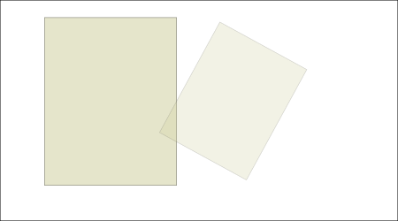
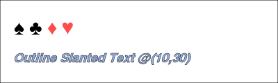
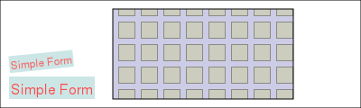
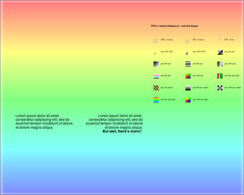
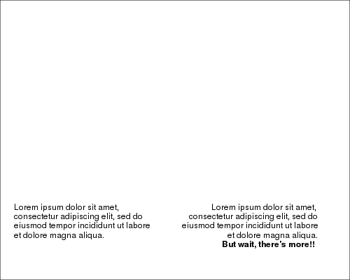

# PDF::Lite

 <a href="https://travis-ci.org/p6-pdf/PDF-Lite-p6"></a>
 <a href="https://ci.appveyor.com/project/dwarring/PDF-Lite-p6/branch/master"></a>

`PDF::Lite` is a minimal class for creating or editing PDF documents, including:
- Basic Text
- Simple forms and images (GIF, JPEG & PNG)
- Graphics and Drawing
- Content reuse (Pages and form objects)
```
use v6;
use PDF::Lite;

my PDF::Lite $pdf .= new;
$pdf.media-box = [0, 0, 200, 100];
my $page = $pdf.add-page;

my $text-block = $page.text: {
    .font = .core-font( :family<Helvetica>, :weight<bold>, :style<italic> );
    .text-position = [10, 10];
    .say: 'Hello, world';
}

$page.graphics: {
    my $img = .load-image: "t/images/lightbulb.gif";
    .do($img, 20 + $text-block.width, 10);
}

my $info = $pdf.Info = {};
$info.CreationDate = DateTime.now;

$pdf.save-as: "examples/hello-world.pdf";
```


#### Text

`.say` and `.print` are simple convenience methods for displaying simple blocks of text with optional line-wrapping, alignment and kerning.

These methods return a text-block object which can be used to
determine the actual width and height of the displayed text block;

```
use PDF::Lite;
my $pdf = PDF::Lite.new;
$pdf.media-box = [0, 0, 500, 150];
my $page = $pdf.add-page;
my $font = $page.core-font( :family<Helvetica> );

$page.text: -> $txt {
    my $para = q:to"--END--";
    Lorem ipsum dolor sit amet, consectetur adipiscing elit, sed do eiusmod tempor incididunt
    ut labore et dolore magna aliqua.
    --END--
            
    $txt.font = $font, 12;
    # output a text box with left, top corner at (20, 100)
    my $text-block = $txt.say( $para, :width(200), :position[ :left(20), :top(100)] );
    say "text height: {$text-block.height}";

    # output kerned paragraph, flow from right to left, right, top edge at (450, 100)
    $txt.say( $para, :width(200), :height(150), :align<right>, :kern, :position[450, 100] );
    # add another line of text, flowing on to the next line
    $txt.font = $page.core-font( :family<Helvetica>, :weight<bold> ), 12;
    $txt.say( "But wait, there's more!!", :align<right>, :kern );
}

$pdf.save-as: "examples/sample-text.pdf";
```


#### Images (`.load-image` and  `.do` methods):

The `.load-image` method can be used to open an image.
The `.do` method can them be used to render it.

```
use PDF::Lite;
my $pdf = PDF::Lite.new;
$pdf.media-box = [0, 0, 450, 250];
my $page = $pdf.add-page;

$page.graphics: -> $gfx {
    my $img = $gfx.load-image("t/images/snoopy-happy-dance.jpg");
    $gfx.do($img, 50, 40, :width(150) );

    # displays the image again, semi-transparently with translation, rotation and scaling

    $gfx.transform( :translate[180, 100]);
    $gfx.transform( :rotate(-.5), :scale(.75) );
    $gfx.FillAlpha = 0.5;
    $gfx.do($img, :width(150) );
}
$pdf.save-as: "examples/sample-image.pdf";
```




Note: at this stage, only the `JPEG`, `GIF` and `PNG` image formats are supported.

### Text effects

To display card suits symbols, using the ZapfDingbats core-font, with diamonds and hearts colored red:

```
use PDF::Lite;
use PDF::Content::Color :rgb;
my $pdf = PDF::Lite.new;
$pdf.media-box = [0, 0, 400, 120];
my $page = $pdf.add-page;

$page.graphics: {

    $page.text: {
	.text-position = [20, 70];
	.font = [ .core-font('ZapfDingbats'), 24];
	.WordSpacing = 16;
	.print("♠ ♣\c[NO-BREAK SPACE]");
	.FillColor = rgb(1, .3, .3);  # reddish
	.say("♦ ♥");
    }

    # Display outline, slanted text

    my $header-font = $page.core-font( :family<Helvetica>, :weight<bold> );

    $page.text: {
	 use PDF::Content::Ops :TextMode;
	.font = ( $header-font, 18);
	.TextRender = TextMode::FillOutlineText;
	.LineWidth = .5;
        .text-transform( :skew[0, -6], :translate[10, 30] );
	.FillColor = rgb(.6, .7, .9);
	.print('Outline Slanted Text @(10,30)');
    }
}

$pdf.save-as: "examples/text-effects.pdf";

```



## Fonts

This module has build-in support for the PDF core fonts: Courier, Times, Helvetica, ZapfDingbats and Symbol.

The companion module PDF::Font::Loader can be used to access a wider range of fonts:

```
    use PDF::Lite;
    use PDF::Font::Loader :load-font;
    my $pdf = PDF::Lite.new;
    $pdf.media-box = [0, 0, 400, 120];
    my $page = $pdf.add-page;
    my $noto = load-font( :file<t/fonts/NotoSans-Regular.ttf> );
    # or lookup by font name (requires fontconfig)
    # $noto = load-font: :name<NotoSans>;

    $page.text: {
        .text-position = [10,100];
        .font = $noto;
        .say: "Noto Sans Regular";
    }

    $pdf.save-as: "examples/fonts.pdf";
```


## Forms and Patterns

Forms are a reusable graphics component. They can be used whereever
images can be used.

A pattern can be used to fill an area with a repeating graphic.

```
use PDF::Lite;
use PDF::Content::Color :rgb;
my $pdf = PDF::Lite.new;
$pdf.media-box = [0, 0, 400, 120];
my $page = $pdf.add-page;

$page.graphics: {
    my $font = .core-font( :family<Helvetica> );
    my $form = .xobject-form(:BBox[0, 0, 95, 25]);
    $form.graphics: {
        # Set a background color
        .FillColor = rgb(.8, .9, .9);
        .Rectangle: |$form<BBox>;
        .paint: :fill;
        .font = $font;
        .FillColor = rgb(1, .3, .3);  # reddish
        .say("Simple Form", :position[2, 5]);
    }
     # display a simple form a couple of times
    .do($form, 10, 10);
    .transform: :translate(10,40), :rotate(.1), :scale(.75);
    .do($form, 10, 10);
}

$page.graphics: {
    my $pattern = .tiling-pattern(:BBox[0, 0, 25, 25], );
    $pattern.graphics: {
        # Set a background color
        .FillColor = rgb(.8, .8, .9);
        .Rectangle: |$pattern<BBox>;
        .paint: :fill;
        # Display an image
        my $img = .load-image("t/images/lightbulb.gif");
        .do($img, 6, 2 );
    }
    # fill a rectangle using this pattern
    .FillColor = .use-pattern($pattern);
    .Rectangle(125, 10, 200, 100);
    .paint: :stroke, :fill;
}

$pdf.save-as: "examples/forms-and-patterns.pdf";

```




### Resources and Reuse

The `to-xobject` method can be used to convert a page to an XObject Form to lay-up one or more input pages on an output page.

```
use PDF::Lite;
my $pdf-with-images = PDF::Lite.open: "t/images.pdf";
my $pdf-with-text = PDF::Lite.open: "examples/sample-text.pdf";

my $new-doc = PDF::Lite.new;
$new-doc.media-box = [0, 0, 500, 400];

# add a page; layup imported pages and images
my $page = $new-doc.add-page;

my $xobj-image = $pdf-with-images.page(1).images[6];
my $xobj-with-text  = $pdf-with-text.page(1).to-xobject;
my $xobj-with-images  = $pdf-with-images.page(1).to-xobject;

$page.graphics: {
    # scale up an image; use it as a semi-transparent background
    .FillAlpha = 0.5; 
    .do($xobj-image, 0, 0, :width(500), :height(400) );
    };

$page.graphics: {
    # overlay pages; scale these down
    .do($xobj-with-text, 20, 100, :width(300) );
    .do($xobj-with-images, 300, 100, :width(200) );
}

# copy whole pages from a document
for 1 .. $pdf-with-text.page-count -> $page-no {
    $new-doc.add-page: $pdf-with-text.page($page-no);
}

$new-doc.save-as: "examples/reuse.pdf";

```





To list all images and forms for each page
```
use PDF::Lite;
my $pdf = PDF::Lite.open: "t/images.pdf";
for 1 ... $pdf.page-count -> $page-no {
    say "page: $page-no";
    my $page = $pdf.page: $page-no;
    # get all X-Objects (images and forms) on the page
    my %object = $page.resources('XObject');

    # also report on images embedded in the page content
    my $k = "(inline-0)";

    %object{++$k} = $_
        for $page.gfx.inline-images;

    for %object.keys -> $key {
        my $xobject = %object{$key};
        my $subtype = $xobject<Subtype>;
        my $size = $xobject.encoded.codes;
        say "\t$key: $subtype {$xobject.width}x{$xobject.height} $size bytes"
    }
}

```

Resource types are: `ExtGState` (graphics state), `ColorSpace`, `Pattern`, `Shading`, `XObject` (forms and images) and `Properties`.

Resources of type `Pattern` and `XObject/Image` may have further associated resources.

Whole pages or individual resources may be copied from one PDF to another.

## Operators

PDF::Content inherits from PDF::Content::Op, which implements the full range of PDF content operations for handling text, images and graphics coordinates:

```
use PDF::Lite;
my $pdf = PDF::Lite.new;
my $page = $pdf.add-page;

# Draw a simple Bézier curve:

# ------------------------
# Alternative 1: Using operator functions (see PDF::Content)

sub draw-curve1($gfx) {
    $gfx.Save;
    $gfx.MoveTo(175, 720);
    $gfx.LineTo(175, 700);
    $gfx.CurveToInitial( 300, 800,  400, 720 );
    $gfx.ClosePath;
    $gfx.Stroke;
    $gfx.Restore;
}

draw-curve1($page.gfx);

# ------------------------
# Alternative 2: draw from content instructions string:

sub draw-curve2($gfx) {
    $gfx.ops: q:to"--END--"
        q                     % save
          175 720 m           % move-to
          175 700 l           % line-to
          300 800 400 720 v   % curve-to
          h                   % close
          S                   % stroke
        Q                     % restore
        --END--
}
draw-curve2($pdf.add-page.gfx);

# ------------------------
# Alternative 3: draw from raw data

sub draw-curve3($gfx) {
    $gfx.ops: [
         'q',               # save,
         :m[175, 720],      # move-to
         :l[175, 700],      # line-to 
         :v[300, 800,
            400, 720],      # curve-to
         :h[],              # close (or equivalently, 'h')
         'S',               # stroke (or equivalently, :S[])
         'Q',               # restore
     ];
}
draw-curve3($pdf.add-page.gfx);

```

Graphics can also be read from an existing PDF file:

```
use PDF::Lite;
my $pdf = PDF::Lite.open: "examples/hello-world.pdf";
say $pdf.page(1).gfx.ops;
```

For a full list of operators, please see the PDF::Content README file.

## Graphics State

A number of variables are maintained that describe the graphics state. In many cases these may be set directly:

```
my $page = (require PDF::Lite).new.add-page;
$page.graphics: {

    .Save;  # save current graphics state
    .CharSpacing = 1.0;     # show text with wide spacing
    # Set the font to twelve point helvetica
    my $face = .core-font( :family<Helvetica>, :weight<bold>, :style<italic> );
    .font = [ $face, 12 ];
    .TextLeading = 12; # new-line advances 12 points
    .say("Sample Text", :position[10, 20]);
    # 'say' has updated the text position to the next line
    .Restore; # restore previous graphics state
    say .CharSpacing; # restored to 0
}
```

A renderer callback can be specified when reading content. This will be called for each graphics operation and has access to the graphics state, via
the `$*gfx` dynamic variable.

```
use PDF::Lite;
use PDF::Content::Ops :OpCode;
my $pdf = PDF::Lite.open: "examples/hello-world.pdf";

my &callback = sub ($op, *@args) {
   given $op {
       when SetTextMatrix {
           say "text matrix set to: {$*gfx.TextMatrix}";
       }
   }
}
$pdf.page(1).gfx(:&callback).ops;
# text matrix set to: 1 0 0 1 10 10
```

## See also

- [PDF::Font::Loader](https://github.com/p6-pdf/PDF-Font-Loader-p6) for rendering Postscript and TrueType fonts.

- This module (PDF::Lite) is based on [PDF](https://github.com/p6-pdf/PDF-p6) and has all of it methods available. This includes:

    - `open` to read an existing PDF or JSON file
    - `save-as` to save to PDF or JSON
    - `update` to perform an in-place incremental update of the PDF
    - `Info` to access document meta-data

- Please see the [PDF::API6 Graphics Documentation](https://github.com/p6-pdf/PDF-API6#appendix-i-graphics) for a description of available operators and graphics, which are also applicable to this module.


