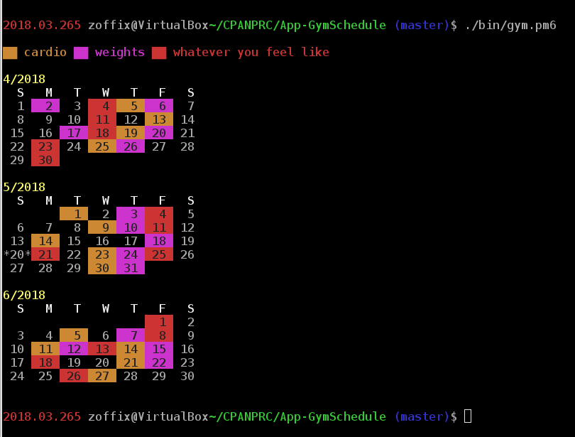

[](https://travis-ci.org/zoffixznet/perl6-App-GymScheduler)

# NAME

`App::GymScheduler` — Randomized schedule maker for your workouts

# TABLE OF CONTENTS
- [RUNNING](#running)
- [DESCRIPTION](#description)
- [EXECUTABLES](#executables)
- [CONFIGURATION KEYS](#configuration-keys)
    - [`seed`](#seed)
    - [`workout-days-per-month`](#workout-days-per-month)
    - [`modes`](#modes)
    - [`modes-desc`](#modes-desc)
    - [`show-months-before`](#show-months-before)
    - [`show-months-after`](#show-months-after)
- [LIMITATIONS](#limitations)
- [REPOSITORY](#repository)
- [BUGS](#bugs)
- [AUTHOR](#author)
- [LICENSE](#license)

# RUNNING

Takes no arguments.

```perl6
    $ gym.p6
```

# DESCRIPTION

This program creates a random schedule for your workouts. It lets you have N
workout days each month, but it randomizes when the workout days occur,
so you don't feel like you're in a rut.



The program ensures the workouts don't happen on the weekend and
supports workout "modes" that it loops through one after another. These rules
are currently hard-coded, but if there's interest to make these customizeable
I can take a PR.

# EXECUTABLES

This distribution installs `gym.p6` program. On its first execution will create
`.gym.p6.conf` file in your home directory. Edit that file to customize
your scheduler, if necessary. Running the program prints a calendar with
your work out days marked off.

# CONFIGURATION KEYS

The config file is in JSON format, an object with key/values:

## `seed`

The saved [`time`](https://docs.perl6.org/routine/time) from which days
generation will start (after subtracting `show-months-before` months). This
is used to seed [`srand`](https://docs.perl6.org/routine/srand) when picking
workout days.

**Defaults to** the [`time`](https://docs.perl6.org/routine/time) when
config file was created.

## `workout-days-per-month`

Number of non-weekend days to pick per month. **Defaults to** `14`.

## `modes`

Takes a list of valid
[`Terminal::ANSIColor`](https://github.com/tadzik/Terminal-ANSIColor) colours.
When highlighting workout days, the colors will rotate. You can make the
program to print a legend of what the colours mean by adding `modes-desc`
key to config file. **Defaults to** `["yellow", "magenta"]`

## `modes-desc`

```js
    "modes-desc": [
        "cardio", "weights"
    ]
```

By default is not specified. Must contain the same number of elements as
`modes` list. When specified, prints a legend of what `modes` colours mean,
by mapping the `modes` elements to `modes-desc` elements.

## `show-months-before`

Number of months before the current month to print. **Defaults to** `1`

## `show-months-after`

Number of months after the current month to print. **Defaults to** `1`

# LIMITATIONS

Requires
[`Terminal::ANSIColor`](https://modules.perl6.org/repo/Terminal::ANSIColor),
which probably doesn't work on Windows's `cmd.exe`.

#### REPOSITORY

Fork this module on GitHub:
https://github.com/zoffixznet/perl6-App-GymScheduler

#### BUGS

To report bugs or request features, please use
https://github.com/zoffixznet/perl6-App-GymScheduler/issues

#### AUTHOR

Zoffix Znet (http://perl6.party/)

#### LICENSE

You can use and distribute this module under the terms of the
The Artistic License 2.0. See the `LICENSE` file included in this
distribution for complete details.

The `META6.json` file of this distribution may be distributed and modified
without restrictions or attribution.
